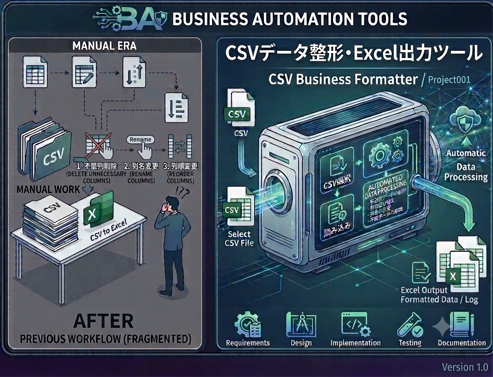

# BusinessAutomationTools

## 概要

CSVやExcelを使った定型業務を効率化したい、事務・営業・経理・製造業などの担当者を対象としています。

**BusinessAutomationTools** は、CSV・Excelを使った日常業務の効率化を目的とする、Python製の業務自動化ツール集です。

手作業で繰り返されるデータの読み込み、整形、転記、出力といった処理を自動化し、作業時間の短縮とヒューマンエラーの削減を目指しています。

## このリポジトリについて

本リポジトリは、個人開発による業務効率化ツールを継続的に公開・改善するためのポートフォリオとして運用しています。

## 特徴

- 実務で発生しやすい定型作業を、シンプルなツールとして自動化
- CSVやExcelを中心としたデータ処理に対応
- 機能ごとにプロジェクトを分けた、確認しやすいリポジトリ構成
- 要件定義、設計、実装、テスト、ドキュメントまでを一貫して管理
- 日本語のデータやWindows環境で扱われる文字コードを考慮

## 現在公開しているプロジェクト

### Project001

#### CSV Business Formatter

CSVデータを読み込み、業務で利用しやすい形に整えてExcelファイルへ出力するツールです。

手作業による不要列の削除、列名の変更、列順の調整、Excelへの転記を自動化します。

[Project001の詳細を見る](Project001_CSVBusinessFormatter/README.md)

## 機能

- UTF-8およびCP932形式のCSV読み込み
- 指定したデータ型を維持した読み込み
- 不要列の削除
- 列名の変更
- 列の並べ替え
- Excel（`.xlsx`）形式での出力
- 出力フォルダの自動作成
- 日時付きファイル名での出力
- ターミナルおよびファイルへのログ出力
- 存在しないファイル、CSV以外のファイル、空ファイル、不正なCSVに対するエラー処理
- `pytest`による単体テストを実施

## 動作環境

| 項目 | 内容 |
| --- | --- |
| 言語 | Python 3.10以上 |
| 主なライブラリ | pandas、openpyxl |
| テスト | pytest |
| 入力形式 | CSV |
| 出力形式 | Excel（`.xlsx`） |

> 現在のProject001は、同梱のサンプルCSVと設定を使用して実行する構成です。列名や整形内容は、用途に合わせてソースコード内の設定を変更できます。

## スクリーンショット

Project001の処理内容を表したイメージです。

## 使用技術

- Python
- pandas
- openpyxl
- pytest
- Git / GitHub

## 今後追加予定

- Excel出力時の基本的な書式設定
- 集計シートの自動作成
- 入力ファイルや整形条件を選択できる設定機能
- CSV・Excelを活用した新しい業務自動化プロジェクト

## ライセンス

本リポジトリはMIT Licenseの元で公開しています。
